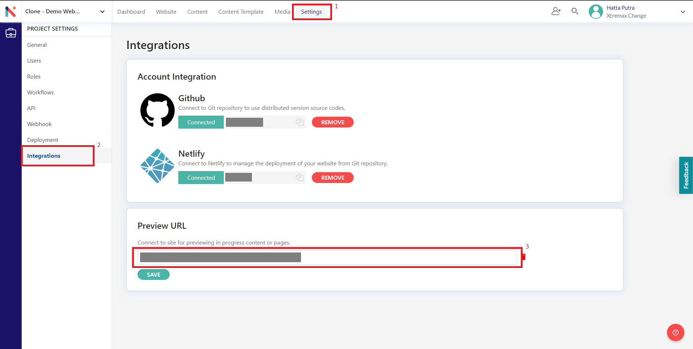

Nimvio Live Preview SDK
===

<details>
<summary>Table of Contents</summary>

- [Nimvio Live Preview SDK](#nimvio-live-preview-sdk)
  - [Installation](#installation)
  - [Usage](#usage)
  - [API Documentation](#api-documentation)
    - [**Data Attributes**](#data-attributes)
    - [**SDK Configuration**](#sdk-configuration)
    - [**Live Preview Utility Functions**](#live-preview-utility-functions)
      - [`onPreviewContentChange(callback)`](#onpreviewcontentchangecallback)
        - [Parameters](#parameters)
        - [Returns](#returns)
        - [Example](#example)
      - [`onIFrameRefresh(callback)`](#oniframerefreshcallback)
        - [Parameters](#parameters-1)
        - [Returns](#returns-1)
        - [Example](#example-1)
      - [`onOpenPreviewContent(callback)`](#onopenpreviewcontentcallback)
        - [Parameters](#parameters-2)
        - [Returns](#returns-2)
        - [Example](#example-2)
      - [`onNewPreviewContent(callback)`](#onnewpreviewcontentcallback)
        - [Parameters](#parameters-3)
        - [Returns](#returns-3)
        - [Example](#example-3)
      - [`onSyncPreviewContent(callback)`](#onsyncpreviewcontentcallback)
        - [Parameters](#parameters-4)
        - [Returns](#returns-4)
        - [Example](#example-4)
  - [Examples](#examples)
</details>

## Installation
**NPM**
```bash
npm i @nimvio/live-preview-sdk
```

**Yarn**
```bash
yarn add @nimvio/live-preview-sdk
```


## Usage
Note that this SDK only works in the browser. Make sure to initialize the SDK in the browser context

**Initialize the SDK**
```typescript
const nimvioSdk = WebLink.init({
  // SDK configuration
  queryParams: 'preview',
  disableWeblink: false
})
```

**Web Link**
If you have already initialized the SDK and configured the [data-attributes](#data-attributes) in your web app, you can view the web link when accessing the website with an additional query parameter as configured in the code. To disable the web link, set the `disableWeblink` configuration to `true`.

**Live Preview**
To add the live preview feature to your web app, you need to follow these steps:
1. Initialize the SDK into your web app.
2. Use the provided [live preview utility functions](#live-preview-utility-functions) to handle specific actions inside the Nimvio page.
3. Fill in the preview url input on project settings page > integrations with the web app url that already been initialized with the SDK.



## API Documentation
The Nimvio Live Preview SDK is a tool that allows you to automatically add interactive elements, to your webpage. These elements are created by parsing specific HTML data attributes on your webpage and injecting links to Nimvio based on those data attributes. When a user clicks on an element with these attributes, they will be redirected to Nimvio or navigate within the Nimvio Website Management page, depending on the type and the context in which it is used.

### **Data Attributes**


| Attribute              | Value | Description         |
| ---------------------- | ----- | ------------------- |
| data-nimvio-project-id | guid  | Nimvio's Project ID |
| data-nimvio-content-id | guid  | Content's ContentID |

For the data attributes placement, you just need to add it based on the context between the HTML component and the content. For example:

You have a content created in Nimvio with this structure:
```json
{
    "ContentID": "Content_2fe70b8c-72ac-4804-b137-dd1da746d7ac",
    "Data": {
        "title": "Lorem Ipsum",
        "description": "Lorem ipsum dolor sit amet, consectetur adipiscing elit.",
        "author": "John Doe"
    },
    ...
}
```
That content will be rendered using this template
```htmlmixed
<section>
    <h1>{{ title }} By: {{ author }}</h1>
    <p>
        {{description}}
    </p>
</section>
```
In order for this SDK to generate the interactive element, you need to add the `data-nimvio-content-id` attribute in that template like this:
```htmlmixed
<section data-content-id="Content_2fe70b8c-72ac-4804-b137-dd1da746d7ac">
    <h1>{{ title }} By: {{ author }}</h1>
    <p>
        {{description}}
    </p>
</section>
```
And for the `data-nimvio-project-id` attribute, you just need to set it once inside a <body> element or any other node that wraps all descendant nodes.

### **SDK Configuration**


| Key                    | Default Value | Description                                                                                                                                                                                                                                             |
| ---------------------- | ------------- | ------------------------------------------------------------------------------------------------------------------------------------------------------------------------------------------------------------------------------------------------------- |
| disableWeblink                       | false              |Option to disable web-link. Web-link will still be shown if the website is opened inside the Nimvio App                                                                                                                                                                                                                                                         |
| queryParams (optional) | 'preview'     | Query parameter required that should be present in the URL to enable the SDK. E.g: queryParam: 'preview', when user access the page with additional parameter preview like https://something.com/some-page?preview it will show the highlighted element |
    
To update the configuration after the SDK initialization, you can use the setConfiguration method. Example:
```javascript
nimvioSdk.setConfiguration({
  // SDK Configuration
  disableWeblink: true
});
```

### **Live Preview Utility Functions**
This SDK has some live preview utility functions that can be used to handle actions from the Nimvio page (where this page is embedded via iframe).

#### `onPreviewContentChange(callback)`
Live Preview Utility function to handle content changes inside the Nimvio Content Editor or Website Management
##### Parameters
- `callback` - Callback function that will be called when there are changes from the Nimvio Content Editor. Only when the app is rendered inside the Nimvio's IFrame
##### Returns
An object with a destroy method to unsubscribe and remove this listener. Should be called when the app is unmounted

##### Example
```typescript
const sdk = WebLink.init()

// Save to variable to call it later
const previewChangeListener = sdk.livePreviewUtils.onPreviewContentChange((newData) => {
  // Some custom function to update the content
  const newContent = updateContentById(
    data.value,
    newData.id,
    newData.formData
  );
  if (newContent) {
    data.value = newContent;
  }
})

// Call the destroy method on the saved function when the app is unmounted to prevent memory leak
previewChangeListener.destroy()
```
#### `onIFrameRefresh(callback)`
Live Preview Utility function to handle refresh on IFrame inside the Nimvio Content Editor or Website Management
##### Parameters
- `callback` - Callback function that will be called when the user clicked refresh button on top of the IFrame. The default action will be reloading the page
##### Returns
An object with a destroy method to unsubscribe and remove this listener. Should be called when the app is unmounted

##### Example
```typescript
const sdk = WebLink.init()

// Save to variable to call it later
const iframeRefresh = sdk.livePreviewUtils.onIFrameRefresh(() => {
  // Some custom function to refetch the content
  refreshContentData()
})

// Call the destroy method on the saved function when the app is unmounted to prevent memory leak
iframeRefresh.destroy()
```

#### `onOpenPreviewContent(callback)`
Live Preview Utility function to handle content being opened inside the Nimvio Content Editor or Website Management via the content tree
##### Parameters
- `callback` - Callback function that will be called when the content being opened inside the Nimvio Content Editor via content tree
##### Returns
An object with a destroy method to unsubscribe and remove this listener. Should be called when the app is unmounted

##### Example
```typescript
const sdk = WebLink.init()

const contentOpenListener = sdk.livePreviewUtils.onOpenPreviewContent((contentData) => {
  // Some custom function to open the content page
  openContentPage(contentData)
})

// Call the destroy method on the saved function when the app is unmounted to prevent memory leak
contentOpenListener.destroy()
```

#### `onNewPreviewContent(callback)`
Live Preview Utility function to handle content being created inside the Nimvio Content Editor or Website Management via the content tree
##### Parameters
- `callback` - Callback function that will be called when the content being created inside the Nimvio Content Editor via content tree
##### Returns
An object with a destroy method to unsubscribe and remove this listener. Should be called when the app is unmounted

##### Example
```typescript
const sdk = WebLink.init()

const newContentListener = sdk.livePreviewUtils.onNewPreviewContent((contentData) => {
  // Some custom function to handle the newly created content
  openContentPage(contentData)
})

// Call the destroy method on the saved function when the app is unmounted to prevent memory leak
newContentListener.destroy()
```

#### `onSycPreviewContent(callback)`
Live Preview Utility function to handle synchronization of latest content (not published) with iframe on Website Management.
##### Parameters
- `callback` - Callback function that will be called when the user clicked sync button on top of the Iframe.
##### Returns
An object with a destroy method to unsubscribe and remove this listener. Should be called when the app is unmounted

##### Example
```typescript
const sdk = WebLink.init()

const newContentListener = sdk.livePreviewUtils.onSycPreviewContent(() => {
  // Some custom function to handle the sync content
  syncContent()
})

// Call the destroy method on the saved function when the app is unmounted to prevent memory leak
newContentListener.destroy()
```


## Examples
How to use utility in project.
#### ```onPreviewContentChange```:
```html
<!-- index.html -->

<!DOCTYPE html>
<html>
  <head>
    <title>Hello World with Nimvio</title>
    <script src="main.js" async defer></script>
    <style>
      .wrapper {
        display: flex;
        flex-direction: column;
        align-items: center;
        max-width: 400px;
        justify-content: center;
        margin: 0 auto;
        text-align: center;
      }
      img {
        max-width: 100%;
      }
    </style>
  </head>

  <body data-nimvio-project-id="YOUR_PROJECT_ID">
    <!-- The HTML elements are there only to display data from Nimvio.
        Using JavaScript, you'll pull the content from your Nimvio project into the elements -->
    <div
      class="wrapper"
      data-nimvio-content-id="YOUR_CONTENT_ID"
    >
      
      <h1 id="headline"></h1>
      <p id="bodyText"></p>
    </div>

    <script src="https://cdn.jsdelivr.net/npm/@nimvio/live-preview-sdk@0.1.4"></script>
    <script type="text/javascript">
      const nimvioSdk = WebLink.init({
        // SDK configuration
        queryParams: "preview",
        disableWeblink: false,
      });

      // define the content id for the live preview when change the content
      const contentID = "YOUR_CONTENT_ID";

      // live preview on content change
      const previewChangeListener =
        nimvioSdk.livePreviewUtils.onPreviewContentChange((newData) => {
          const { id, formData } = newData;
          if (id === contentID) { // check if the current preview content is same with the content edit
            const { headline, bodyText, mediaUrl } = formData;
            const sectionEl = document.querySelector(
              `[data-nimvio-content-id=${contentID}]`
            );
            // headline update
            sectionEl.querySelector("#headline").innerText = headline;
            // body text update
            // if the body is using RTE component, need to using innerHTML instead of innerText
            sectionEl.querySelector("#bodyText").innerHTML = bodyText;
            // media update
            sectionEl.querySelector("#banner").src = mediaUrl.MediaUrl;
          }
        });
    </script>
  </body>
</html>
```

```javascript main.js
//main.js

const API_CD_URL = "REST_API_URL_LINK";

// Fetch json data from Nimvio API CD and return it
async function fetchJSONData() {
  const response = await fetch(API_CD_URL);
  const jsonData = await response.json();

  return jsonData;
}

// Processes the retrieved data and displays it on the page.
function processData(response) {
  const { Data } = response.data[0];
  const bodyText = Data.bodyText;
  const headline = Data.headline;

  const picture = Data.mediaUrl.MediaUrl;
  document.getElementById("banner").src = picture;
  document.getElementById("bodyText").innerHTML = bodyText;
  document.getElementById("headline").append(headline);
}

// Render function
async function render() {
  const data = await fetchJSONData();
  processData(data);
}

render();
